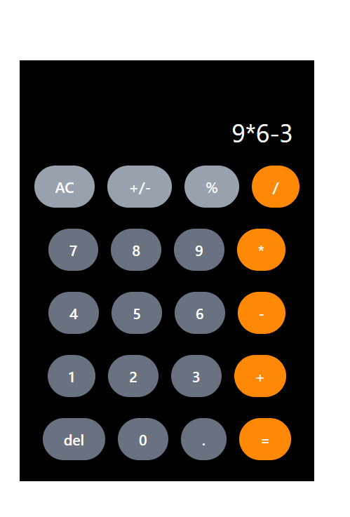

# Calculator 
A simple, responsive calculator application built with Next.js and React's useState hook, designed with an interface similar to the iPhone's native calculator.

## Description
This project provides a basic calculator interface that allows users to perform standard arithmetic operations such as addition, subtraction, multiplication, and division. It's designed to be straightforward and demonstrate fundamental state management in a Next.js environment.
## Features

- Basic arithmetic operations (add, subtract, multiply, divide, percentage)

- Clear all (AC) functionality

- Delete last entry (DEL) functionality

- Toggle positive/negative (+/-) functionality

- Responsive design for various screen sizes

- Uses React's useState for efficient state management 


## Technologies Used

**Next.js:** React framework for production-ready applications.

**React:** JavaScript library for building user interfaces.

**Lucide React:** A collection of open-source React components for Lucide icons.

**JavaScript (ES6+):** Core language for application logic.

**CSS Modules (or Tailwind CSS if preferred for styling):** For styling components.


## Installation


**Clone the repository:**

```bash
git clone https://github.com/sophiathapa/Calculator.git
cd calculator
```

**Install dependencies (Lucide React):**

```bash
npm install lucide-react
# or
yarn add lucide-react
```

**Running the Application**

```bash
npm run dev
# or
yarn dev
```
## Screenshots




